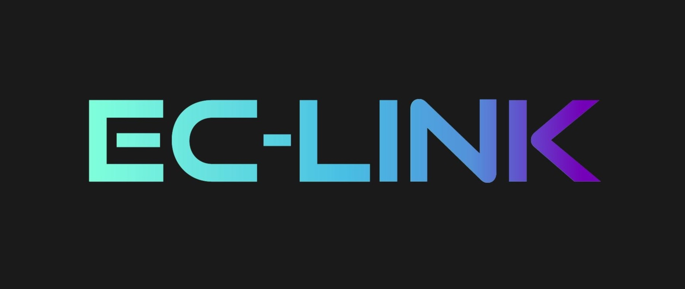
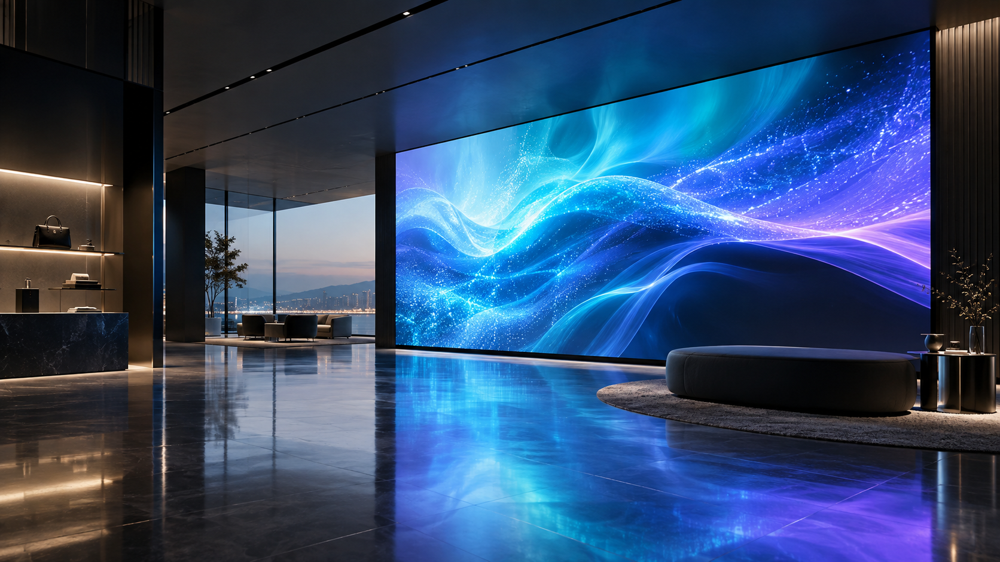
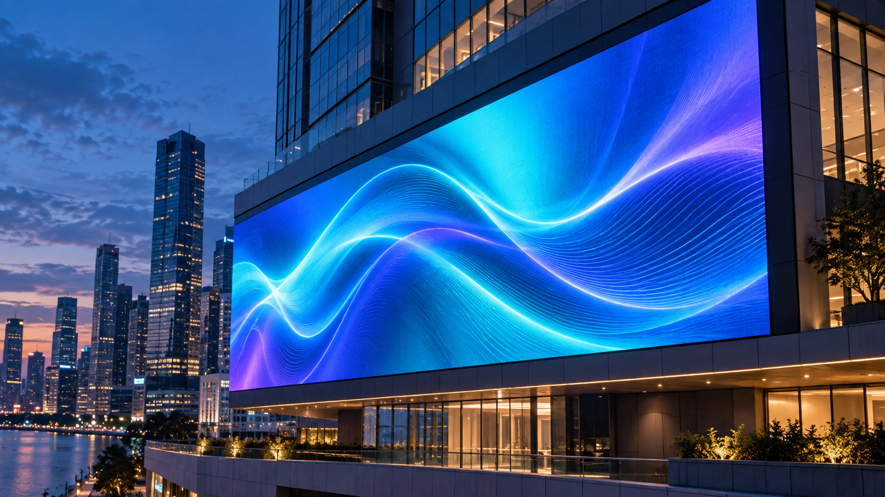

<!doctype html>
<html lang="en">
  <head>
    <meta charset="UTF-8" />
    <meta name="viewport" content="width=device-width, initial-scale=1.0" />
    <meta name="description" content="Eclink supplies brilliant LED walls and high-performance industrial fans." />
    <title>Eclink | LED Walls & Industrial Fans</title>
    <link rel="preconnect" href="https://fonts.googleapis.com" />
    <link rel="preconnect" href="https://fonts.gstatic.com" crossorigin />
    <link href="https://fonts.googleapis.com/css2?family=DM+Mono:wght@400;500&family=Manrope:wght@400;500;600;700;800&display=swap" rel="stylesheet" />
    <link rel="stylesheet" href="styles.css" />
  </head>
  <body>
    

    <header class="site-header">
      
      <nav class="main-nav" aria-label="Main navigation">
        <a class="is-current" href="index.html">Home</a>
        <a href="about.html">About Us</a>
        <a href="solutions.html">Products</a>
        <a href="projects.html">Resources</a>
      </nav>
      <a class="header-contact" href="contact.html">Contact Us ↗</a>
      <button class="menu-button" aria-label="Open navigation">☰</button>
    </header>

    <main id="top">
      <section class="hero">
        

          
 EC-Link LED Wall Company

          

            <article class="hero-slide is-active"><h1>Experience the <em>EC-Link difference.</em></h1>
Powerful LED wall solutions engineered to make your message impossible to miss.

<a class="button button-primary" href="solutions.html">Discover more →</a><a class="text-link" href="contact.html">Request a quote ↗</a>
</article>
            <article class="hero-slide"><h1>Powerful displays <em>for modern brands.</em></h1>
From high-impact retail screens to large-format installations, make every moment visible.

<a class="button button-primary" href="solutions.html#led-walls">Explore products →</a><a class="text-link" href="projects.html">See applications ↗</a>
</article>
            <article class="hero-slide"><h1>Complete visual <em>& airflow solutions.</em></h1>
The technology, design, and support to keep your environment impressive and comfortable.

<a class="button button-primary" href="solutions.html">Explore solutions →</a><a class="text-link" href="contact.html">Talk to Eclink ↗</a>
</article>
          

          
<button class="slider-arrow slider-prev" type="button" aria-label="Previous slide">←</button>
<button class="is-active" type="button" aria-label="Show slide 1"></button><button type="button" aria-label="Show slide 2"></button><button type="button" aria-label="Show slide 3"></button>
<button class="slider-arrow slider-next" type="button" aria-label="Next slide">→</button>

        

        

          <video class="hero-video" autoplay muted loop playsinline poster="assets/eclink-logo.jpg"><source src="assets/eclink-hero.mp4" type="video/mp4" /></video>
          

          

          

          
EC-LINK<b>LIGHT / AIR / IMPACT</b>

          
<b>01</b>BRILLIANCE IN MOTION

          
LED WALLS · INDUSTRIAL FANS

        

        
SCROLL TO DISCOVER<i></i>EST. 2014 · PHILIPPINES

      </section>

      <section class="marquee" aria-label="Key benefits">
        
BRIGHTER SPACES <b>✳</b> COOLER OPERATIONS <b>✳</b> BETTER PERFORMANCE <b>✳</b> BRIGHTER SPACES <b>✳</b> COOLER OPERATIONS <b>✳</b> BETTER PERFORMANCE <b>✳</b>

      </section>

      <section class="markets">
        

 Check our category list
<h2>Markets we <em>serve.</em></h2>

        
<a href="contact.html?service=LED%20Walls">01 Office <b>↗</b></a><a href="contact.html?service=LED%20Walls">02 Store / Restaurant <b>↗</b></a><a href="contact.html?service=LED%20Walls">03 Outdoor Advertising <b>↗</b></a><a href="contact.html?service=LED%20Walls">04 Church <b>↗</b></a><a href="contact.html?service=LED%20Walls">05 Hotel <b>↗</b></a><a href="contact.html?service=LED%20Walls">06 School <b>↗</b></a><a href="contact.html?service=LED%20Walls">07 Event <b>↗</b></a>

      </section>

      <section class="why-ec">
        

        

          
 Why choose EC-Link LED?

          <h2>Visual technology with real staying power.</h2>
          
EC-Link creates LED display solutions, interactive kiosks, and industrial-grade equipment designed to help businesses captivate, communicate, and convert. We combine modern visual technology with practical local support.

          
From outdoor LED walls and indoor displays to custom-built systems, our team helps shape bold visual impact for retail, real estate, entertainment, logistics, and corporate brands.

          <a class="text-link" href="about.html">Get to know EC-Link ↗</a>
        

      </section>

      <section class="solutions section" id="solutions">
        

          
 Why choose EC-Link LED?

          <h2>Technology that performs.</h2>
          
Since 2018, EC-Link has combined high-impact LED displays, interactive visual technology, and industrial-grade equipment for businesses across the Philippines.

        

        

          <article class="solution-card led-card" data-reveal>
            
01 / VISUAL↗

            

            
<h3>LED Walls</h3>
Unmissable visual experiences, indoors and out. Ultra-vivid, seamless, and built for the long run.
<a href="solutions.html#led-walls">Discover LED Walls →</a>

          </article>
          <article class="solution-card fan-card" data-reveal>
            
02 / AIRFLOW↗

            

<i></i><i></i><i></i><i></i><i></i><b></b>

            
<h3>Industrial Fans</h3>
Smarter air movement for large spaces. Quiet, efficient, and designed for all-day comfort.
<a href="solutions.html#industrial-fans">Discover Industrial Fans →</a>

          </article>
        

      </section>

      <section class="numbers" id="why-eclink" data-reveal>
        

 Eclink by the numbers
<h2>Made to make an impact.</h2>

        
<strong>10+</strong>
Years delivering reliable systems

        
<strong>500+</strong>
Installations completed

        
<strong>24/7</strong>
Support when you need it

      </section>

      <section class="benefits">
        

 Built for every environment
<h2>Display solutions <em>that deliver.</em></h2>

        <article class="benefit-card benefit-indoor" data-reveal>

 Indoor LED
<h3>Captivating in every detail.</h3><ul><li>Exceptional brightness & color clarity</li><li>Seamless, bezel-free visual canvas</li><li>Reliable for continuous 24/7 display</li></ul><a href="solutions.html#led-walls">Explore indoor LED →</a>
</article>
        <article class="benefit-card benefit-outdoor" data-reveal>

 Outdoor LED
<h3>Built to stay visible.</h3><ul><li>High visibility in changing conditions</li><li>Weather-ready, rugged construction</li><li>Modular, scalable system design</li></ul><a href="solutions.html#led-walls">Explore outdoor LED →</a>
</article>
      </section>

      <section class="projects section" id="projects">
        

 Selected work
<h2>Designed around your operation.</h2>
<a class="text-link" href="projects.html">View all projects ↗</a>

        

          <article class="project project-wide" data-reveal>

NOW <b>OPEN</b>

RETAIL / MAKATI<h3>Storefront that stops traffic</h3><a href="projects.html">View project →</a>
</article>
          <article class="project" data-reveal>

<i></i><i></i><i></i>

LOGISTICS / LAGUNA<h3>Airflow at warehouse scale</h3><a href="projects.html">View project →</a>
</article>
        

      </section>

      <section class="cta" id="contact">
        

        
 Let’s build something visible

        <h2>Ready to elevate your space?</h2>
        <a class="button button-light" href="mailto:inquiries@ec-linkph.com">Start a conversation →</a>
        
+63 962 265 7785 &nbsp;·&nbsp; 0962 676 9761 &nbsp;·&nbsp; inquiries@ec-linkph.com

      </section>
    </main>

    <footer>
      
      
LED walls & industrial fans for spaces with ambition.

      
<a href="solutions.html">Solutions</a><a href="about.html">About</a><a href="contact.html">Contact</a>

      <small>© 2026 Eclink. All rights reserved.</small>
    </footer>
    
  </body>
</html>
